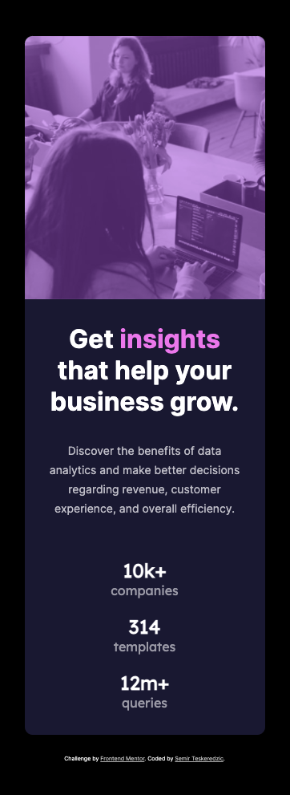

# Frontend Mentor - Stats preview card component solution

This is a solution to the [Stats preview card component challenge on Frontend Mentor](https://www.frontendmentor.io/challenges/stats-preview-card-component-8JqbgoU62). Frontend Mentor challenges help you improve your coding skills by building realistic projects. 

## Table of contents

- [Overview](#overview)
  - [The challenge](#the-challenge)
  - [Screenshot](#screenshot)
  - [Links](#links)
- [My process](#my-process)
  - [Built with](#built-with)
- [Author](#author)

## Overview

### The challenge

Users should be able to:

- View the optimal layout depending on their device's screen size

### Screenshot

### Links

- Solution URL: [Solution URL](https://www.frontendmentor.io/solutions/stats-preview-card-done-in-html-and-css-only-jBKWC4rvq)
- Live Site URL: [Live Site URL](https://semirteskeredzic.github.io/stats-preview-card/)

## My process

Before starting to code I've created a new repository on Github and initialized it inside my project folder. I've switched to the first branch and left there to focus on requirements per design.
Then I've opened design files and inspected the structure. 
Then I wrote down structure in HTML elements during which I added classes to all elements using double dash and single dash naming depending on the element. I've also put global styling such as font import and stylesheet import to the HTML file. That was the content of the first branch, I've commited it, pushed, and merged to main.
Next, I've created new branch and started working on design mobile first. I've used flexbox to arrange items and media queries to accomplish responsiveness. After finishing up styling again I've commited, pushed, and merged to main.
In this stage I published the repo to GitHub pages, then I tested on my mobile device as well as on laptop again and fixed eventual issues. Last step was writing this README.md.

### Built with

- Semantic HTML5 markup
- CSS custom properties
- Flexbox

## Author

- Github - [Semir Teskeredzic](https://github.com/semirteskeredzic)
- Frontend Mentor - [@semirteskeredzic](https://www.frontendmentor.io/profile/semirteskeredzic)
- Twitter - [@dofedome](https://www.twitter.com/dofedome)
